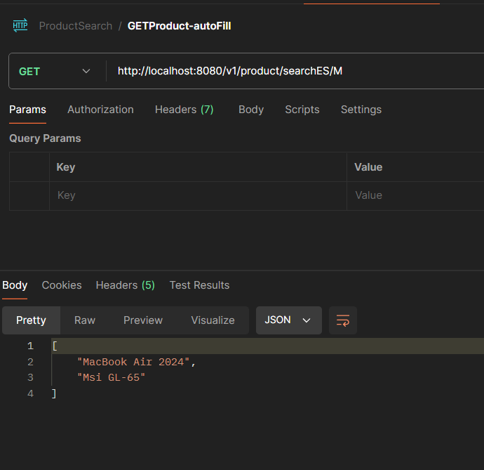
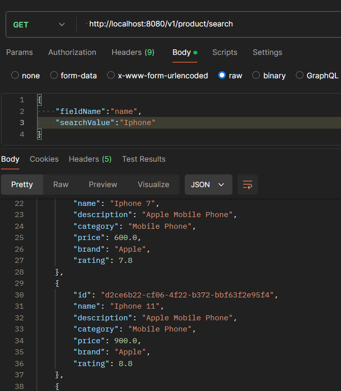
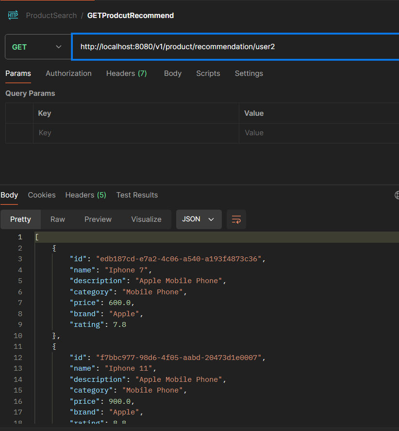

# E-Commerce Product Search and Recommendation System 🔍🛒

ProductRecommendationAPI is an e-commerce product search and recommendation system that allows users to search for products, filter results by various criteria, and get personalized recommendations based on their search and purchase history.

## Features

You will get some suggestion even you type just one letter or you write wrong word benefit from elasticsearch. You will receive personalized search values ​​based on your past searches or purchase history.

Product Search:

- Search with autocomplete suggestions using by elastic search. 

Personalized Recommendations:

- Recommend products based on user search history.
- Recommend products based on user purchase history.

## Technology Stack

**Java:** 17

**Dependencies:** ElasticSearch, Spring web, Lombok

## End Points

Bu projeyi çalıştırmak için aşağıdaki ortam değişkenlerini .env dosyanıza eklemeniz gerekecek

Search in whatever category you want with auto-fill:
` http://localhost:8080/v1/product/searchES `

Search with auto-suggested:
` http://localhost:8080/v1/product/search`

Search recommendation with your search and purchase history:
` http://localhost:8080/v1/product/recommendation `

  
  

  

## Results

### Search in whatever category you want with auto-fill: 

` http://localhost:8080/v1/product/search`

- When the user wants to search for a product but doesn't remember the name of the product, he just types a letter and our API fills in the letter and suggests some products.
  In our case, user is just typing M and getting that result from our API.

****************************************************

### Search with auto-suggested:

` http://localhost:8080/v1/product/search`

- When user makes a search about some product, our api will check to database and will return the product or suggest most relevant product which are exist in the database. In our case, user enter "Iphone" and api returns "Iphone 7" and "Iphone 11".

****************************************************

### Search recommendation with your search and purchase history:
` http://localhost:8080/v1/product/recommendation `

 - In that case, user will receive suggestions based on own search history or own purchase based. That means you will receive product suggestions which is same category with your past purchases.
   In our case, these are suggestions of user2.

  

  ### For more, you can run my codes and test the API ...

  
